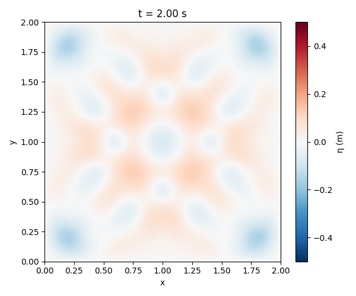

---
title: 'pyCoastal: a Python package for Coastal Engineering'
tags:
  - Python
  - numerical modeling
  - Coastal Engineering
  - Computational Fluid Dynamics
authors:
  - name: Stefano Biondi
    orcid: 0009-0001-5737-6012
    affiliation: "1, 2" 

affiliations:
 - name: University of Florida, Gainesville, FL, United States
   index: 1
 - name: National Institute of Standard and Technologies (NIST), Gaithersburg, MD, United States
   index: 2

date: 17 July 2025
bibliography: paper.bib

# Summary

pyCoastal is an open-source Python framework for the numerical simulation of coastal hydrodynamics and scalar transport processes. It provides a modular and extensible platform for solving linear and nonlinear partial differential equations relevant to coastal systems, including wave propagation, pollutant dispersion, and viscous fluid dynamics. The framework supports structured 1D and 2D Cartesian grids, configurable through lightweight YAML files, and includes reusable components for grid generation, boundary condition management, numerical operators, and time integration schemes. Physical modules are implemented as standalone classes and can be easily composed or extended for prototyping and research. pyCoastal emphasizes clarity and reproducibility, with a strong focus on animated visualization, clean code structure, and pedagogical transparency. It is particularly suited for research prototyping, model intercomparison studies, and educational applications in coastal engineering, fluid mechanics, and numerical modeling.

# Statement of need

Numerical modeling of coastal processes—such as wave propagation, shallow water flow, and pollutant transport—typically relies on specialized software frameworks that are often complex to configure, extend, or adapt to new applications. Tools like SWAN, ADCIRC, and OpenFOAM, although powerful, present significant barriers due to their steep learning curves and rigid internal structures. Studies have shown that more computationally demanding models do not necessarily yield higher accuracy, especially when simpler models are tuned effectively [@Lashley et al., 2020]. Furthermore, successful calibration of numerical models hinges on the ability to accurately represent key physical processes and structural features [@Simmons et al., 2017]. This complexity poses challenges both for researchers aiming to prototype models rapidly and for instructors seeking clear, demonstrable tools for teaching.

pyCoastal addresses this issue by offering a lightweight and modular coastal modeling framework fully in Python. It is designed to prioritize clarity and reproducibility, allowing users to define simulations through human-readable YAML configuration files and execute them with minimal setup. The codebase provides reusable components for grid generation, numerical operators, time integration schemes, and boundary condition handling, supporting both classical and custom physical models with ease. Its structure is designed to support both research applications and instructional use in topics such as coastal hydrodynamics, numerical modeling, and environmental fluid mechanics. Moreover, the framework integrates numerous established coastal‑engineering formulations—such as wave run‑up, sediment transport, and boundary layer calculations, enabling users to compute essential coastal parameters with ease. As a result, this module functions as a versatile library suitable for both academic research and industrial applications. In conclusion, pyCoastal offers a balance of flexibility and structure suitable for a range of academic and applied contexts.

# Examples

here are explained some cases implemented in pyCoastal to play around:

### wave generation

The `generate_irregular_wave` function builds a band-limited random wave time series based on standard oceanographic spectra:

1. **Pierson–Moskowitz (PM)** spectrum for a fully-developed sea [@Henrique et al., 2003]:

\[
S_{PM}(f) = \frac{5}{16}\,H_s^2\,f_p^4\,f^{-5}\,\exp\left[-\frac{5}{4} \left(\frac{f_p}{f}\right)^4 \right]
\]

where \(f_p = 1/T_p\).

2. **JONSWAP** spectrum, modifying PM with a peaked enhancement [@Hasselmann et al., 1973]:

\[
S_{J}(f) = S_{PM}(f)\;\gamma^{\displaystyle \exp\!\left[-\frac{1}{2\sigma^2}\left(\frac{f}{f_p} - 1\right)^2\right]}
\]

where \(\sigma\) depends on \(f\) relative to \(f_p\).

Once the spectral density \(S(f)\) is defined, the surface elevation time series is composed as:

\[
\eta(t) = \sum_{i} A_i \cos\left(2\pi f_i t + \phi_i\right), \quad \text{where} \quad A_i = \sqrt{2 S(f_i)\,\Delta f}
\]


### 2D Water Drop (Circular Wave Propagation)

This example demonstrates the classic 2D linear wave equation:

\[
\eta_{tt} = c^2 \nabla^2 \eta
\]

Using `water_drop.py`, this simulation showcases:

- **Zero-Dirichlet boundary conditions** on all domain edges, ensuring waves vanish at the boundaries.
- A **Gaussian hump** as the initial condition, representing a localized disturbance ("water drop") at the domain center.
- A **second-order finite-difference scheme** in both space and time:
  
  \[
  \eta_{\text{new}} = 2\eta - \eta_{\text{old}} + (c\,\Delta t)^2 \nabla^2 \eta
  \]
  
- Real-time animation using `matplotlib.animation.FuncAnimation`, allowing users to visually observe expanding circular wavefronts and their reflections.
- Fully configurable via **YAML**, enabling easy adjustment of domain size, resolution, wave speed, CFL number, and simulation duration without modifying the code.

#### Run the Example

```bash
python examples/water_drop.py


# Figures




# References

@article{Simmons et al., 2017,
    title = {Calibrating and assessing uncertainty in coastal numerical models},
    journal = {Coastal Engineering},
    volume = {125},
    pages = {28-41},
    year = {2017},
    issn = {0378-3839},
    doi = {https://doi.org/10.1016/j.coastaleng.2017.04.005},
    url = {https://www.sciencedirect.com/science/article/pii/S0378383916303234},
    author = {Joshua A. Simmons and Mitchell D. Harley and Lucy A. Marshall and Ian L. Turner and Kristen D. Splinter and Ronald J. Cox}

@article{Lashley et al., 2020,
   title={Benchmarking of numerical models for wave overtopping at dikes with shallow mildly sloping foreshores: Accuracy versus speed},
   volume={130},
   ISSN={1364-8152},
   url={http://dx.doi.org/10.1016/j.envsoft.2020.104740},
   DOI={10.1016/j.envsoft.2020.104740},
   journal={Environmental Modelling &amp; Software},
   publisher={Elsevier BV},
   author={Lashley, Christopher H. and Zanuttigh, Barbara and Bricker, Jeremy D. and van der Meer, Jentsje and Altomare, Corrado and Suzuki, Tomohiro and Roeber, Volker and Oosterlo, Patrick},
   year={2020},
   month=aug, pages={104740} }

@article{Hasselmann et al., 1973,
    author = {Hasselmann, Klaus and Barnett, T. and Bouws, E. and Carlson, H. and Cartwright, D. and Enke, K and Ewing, J and Gienapp, H and Hasselmann, D. and     Kruseman, P. and Meerburg, A and Muller, Peter and Olbers, Dirk and Richter, K and Sell, W. and Walden, H.},
    year = {1973},
    month = {01},
    pages = {1-95},
    title = {Measurements of wind-wave growth and swell decay during the Joint North Sea Wave Project (JONSWAP)},
    volume = {8},
    journal = {Deut. Hydrogr. Z.}
}

@article {Henrique et al., 2003,
    author = "Jose Henrique G. M. Alves and Michael L. Banner and Ian R. Young",
    title = "Revisiting the Pierson–Moskowitz Asymptotic Limits for Fully Developed Wind Waves",
    journal = "Journal of Physical Oceanography",
    year = "2003",
    publisher = "American Meteorological Society",
    address = "Boston MA, USA",
    volume = "33",
    number = "7",
    doi = "10.1175/1520-0485(2003)033<1301:RTPALF>2.0.CO;2",
    pages=      "1301 - 1323",
    url = "https://journals.ametsoc.org/view/journals/phoc/33/7/1520-0485_2003_033_1301_rtpalf_2.0.co_2.xml"
}